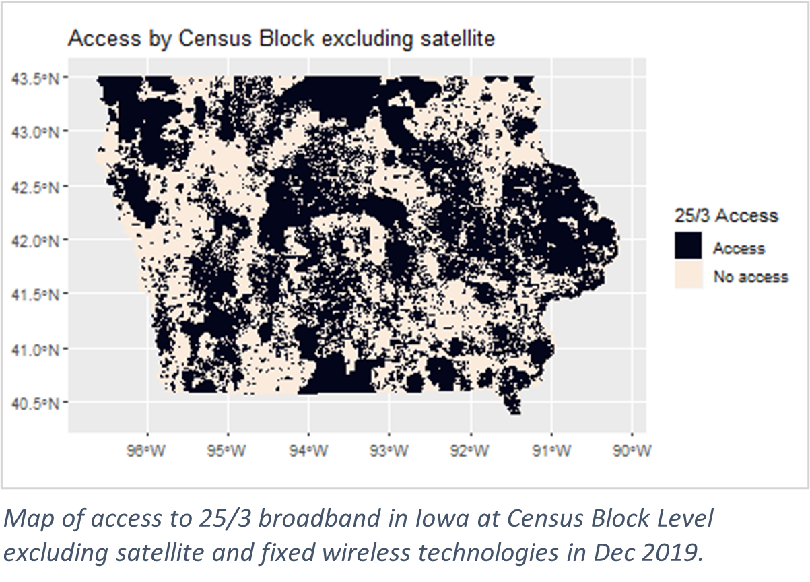

```{r, include = FALSE}
knitr::opts_chunk$set(
  collapse = TRUE,
  comment = "#>",
  fig.path = "man/figures/README-",
  out.width = "100%",
  fig.align="center"
)
library(knitr)
library(devtools)
install_github("kdmulligan/processFCC")
library(processFCC)
```

# Package to Process FCC Fixed Broadband Datasets

## Installation

You can install the development version of processFCC like so:
```{r, warning=FALSE, message=FALSE, eval = FALSE}
install.packages("devtools")
library(devtools)
install_github("kdmulligan/processFCC")
library(processFCC)
```

## Background of FCC Fixed Broadband Datasets

The goal of processFCC is to process the fixed broadband data sets from the [Federal Communications Commision (FCC)](https://www.fcc.gov/general/broadband-deployment-data-fcc-form-477). The FCC is the federal agency responsible for implementing and enforcing America’s communications laws and regulations. They regulate interstate and international communications by radio, television, wire, satellite, cable, and internet in all 50 states, D.C., and U.S. territories. 

The FCC Broadband Data comes from Form 477, which facilities-based broadband providers are required to submit to the FCC biannually for any locations where they offer internet service at speeds greater than or equal to 200 kbps. Fixed providers report Census Blocks where they provide service, along with information about technology type and speeds. Thus, fixed provider data is on the Census Block level, which is the smallest unit of census geography. Importantly for interpretation, if a provider indicates they provide broadband to a Census Block on FCC Form 477 it does not mean every location in the Census Block has access to the broadband service. It simply means at least one location, person, or business in the Census Block has access to broadband at the reported speed/technology. It is important to consider this as it may lead to overreporting of broadband access within the FCC Fixed Broadband Deployment data. FCC data measures where there is access to broadband according to Internet service providers. Thus, the FCC data provides a picture of broadband claimed availability—what may be possible or what is potentially available at the physical or technological level.

Because the forms are submitted biannually, data is provided for June and December of each year beginning December 2014, and available through December 2020. Prior to December 2019 the datasets have additional columns  indicating different upload and download speeds for consumer versus business customers, thus it is important to use the `get_colname` function in the package to get the proper column names for the datasets you are downloading and working with.

```{r}
get_colname(year = 2017, month = "June")

get_colname(year = 2020, month = "June")
```


These data sets are key to knowing where fixed broadband internet is provided however due to their size (> 8 GB) and complexity many researchers avoid using them. The data cannot be used in its raw form available from the FCC website because there are multiple rows per Census Block per unique broadband provider, technology, and speed. This means there are numerous options for measurement of broadband access which could be chosen to fit your research question. Some examples include average upload or download speeds, number of providers, technology offered, or penetration rate. The raw data has many nuances which can be confusing, so it is vital to understand its format before rolling it up to fit a research question. Additionally, FCC data are at the Census Block level, the smallest unit of Census Geography, which gives greater flexibility. It can be rolled up to any higher Census Geography such as Census Block Group, Census Tract, or County.
This package has function to download the desired year/month of the data, get the proper column names, put the dataset into a SQLite database, and process the data to a smaller level. The processed form of the data is one row per specificed census geography, such as census block, and counts the number of internet service providers providing internet at or above the given download and upload speed thresholds, up to 5 speed thresholds combinations can be specified. It is also possible to exclude different broadband technologies or filter down to specific states.

### Census Geography
The FCC data are reported at the Census Block level using the 15-digit FIPS code. This 15-digits FIPS code allows us to group the data to a bigger geographic level, such as Census Block group or County. The 15-digit FIPS code works as follows:

    - AABBBCCCCCCDEEE
        - A: state
        - B: county
        - C: Census Tract
        - D: Census Block Group
        - E: Census Block
        
Each group is nested within the previous (e.g., Counties are nested within States, meaning FIPS county codes are unique within states, and so on for smaller census geography units).

### Technology Codes
Within the FCC Fixed Broadband Deployment Data there are 14 technology codes:

    - 10: Asymmetric xDSL
    - 11: ADSL2, ADSL2+
    - 12: VDSL
    - 20: Symmetric xDSL
    - 30: All other copper-wire tech
    - 40: Cable Modem other
    - 41: Cable Modem – DOCSIS 1, 1.1 or 2.0
    - 42: Cable Modem – DOCSIS 3.0
    - 43: Cable Modem – DOCSIS 3.1 
    - 50: Fiber to the end user
    - 60: Satellite
    - 70: Terrestrial Fixed Wireless
    - 90: Electric Power Line
    - 0: All Other
    

Not all technologies are equally effective or reliable. The types of technology are not discussed here, but for more information visit [BroadbandNow](https://broadbandnow.com/research).

The option to process the FCC data without certain technologies came about because in our research projects we excluded satellite and fixed wireless technologies. This is because, according to the Fourteenth Broadband Deployment Report, the FCC broadband deployment data indicates satellite service is available nearly everywhere, however subscription rates are relatively low. The report also denotes that fixed wireless data in the FCC broadband deployment data follows trends similar to satellite, potentially signifying the deployment data overestimates availability of satellite and fixed wireless technologies. Additionally, fixed wireless and satellite technologies are inconsistent, suffering from issues such as weather interference, and delays more than other broadband technologies. These issues imply that both satellite and fixed wireless technology reporting may be especially suspect as a measure of access; in particular when those considerations are made along rural-urban lines.

Another reason for the flexibility allowed with technology codes is that one may wish to focus only on one type of technology, excluding all others, to see where it is available through the country or a state.

### Broadband Speeds
Currently adequate broadband service is considered a download speed of 25 Mbps and upload speed of 3 Mbps. (The FCC definition prior to 2015 was established in 2010 as 4 Mbps download and 1 Mbps upload.) Required speeds as technology needs continue to grow is a topic of ongoing discussion.The consensus is that the average broadband user needs higher download speeds than upload, but this may be an outdated understanding of consumer needs. The FCC Consumer Broadband Speed Guide indicates that a speed threshold of 25/3 Mbps is adequate for activities such as general usage, streaming video, video conferencing, and gaming. However, the FCC Household Broadband Guide indicates that download speeds of more than 25 Mbps may be necessary for households with moderate to high broadband use by 4 or more users or devices at a time. On the other hand, some say that 25/3 Mbps is an outdated defintion of broadband and 100/10 Mbps is standard.

With the various speeds in mind, the processing function of this package was written to allow for flexibility of user inputted speed thresholds. 5 different thresholds can be considered in the process function which counts the number of providers providing internet at or above the threshold within the specified census geography region. One must input a vector of download speeds and a vector of upload speeds of equal length. The elements of the vectors are matched for the thresholds. 

Once the FCC fixed broadband data is on a level where there is one row per census
geography region it is much easier to work with and opens a world of possibilities, 
such as calculating the proportion of people within a larger census geography with
access to a certain speed or making maps of the number of providers per region. For example,
here is a map of the state of Iowa at the Census Block level created using the FCC data. Satellite technology was excluded in rolling up the data to a 25/3 threshold. The provider count at 25/3 Mbps was then converted to a binary variable where 1 indicates access to broadband at 25/3 and 0 indicates no access to internet at 25/3.


```{r, echo=FALSE, out.width="50%", fig.align = "center"}



```

<!-- {:height="36px" width="36px"} -->


# How to use this package

This is a basic example which shows you how to solve a common problem:

```{r example, eval = FALSE}
library(processFCC)
## basic example code


month = "Dec"
year = 2018
system.time(download_FCC(year, month)) #time: 
use_colnam <- get_colname(year, month)
con <- dbConnect(SQLite(), dbname = "fcc.sqlite")
name_csv <- paste0("FCC_fixed_brdbd_", month, "_", year, ".csv")
system.time(csv_to_sql_db(name_csv, con, 
                                  db_colnam = use_colnam))
# dbDisconnect(con)
process_fcc(con, year = 2018, month = "June", geogr = "ct",
            tech_exc = c("0", "60", "70"), thresh_down = c(25, 100),
            thresh_up = c(5, 10))

dbDisconnect(con)
```


